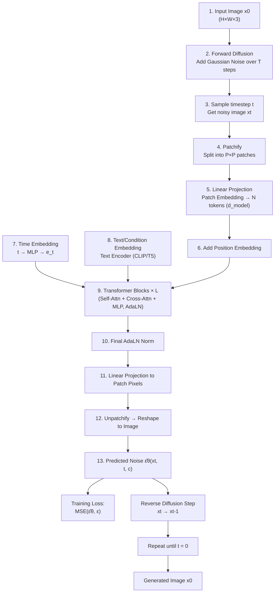
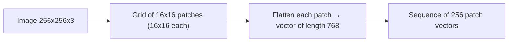
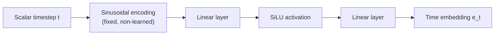
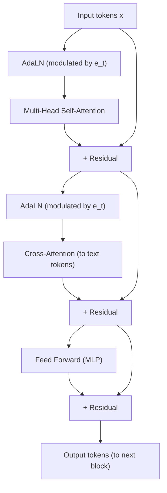
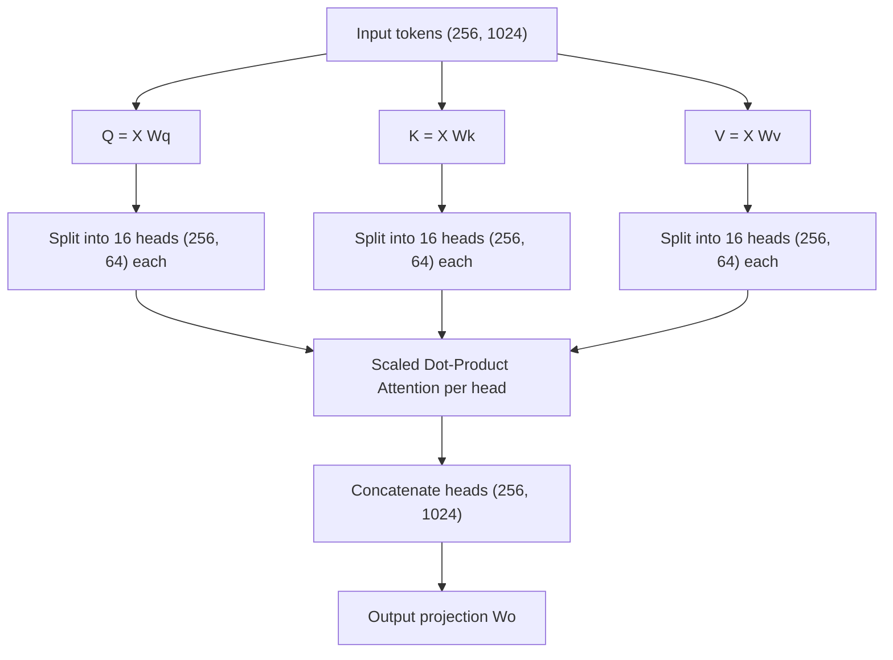
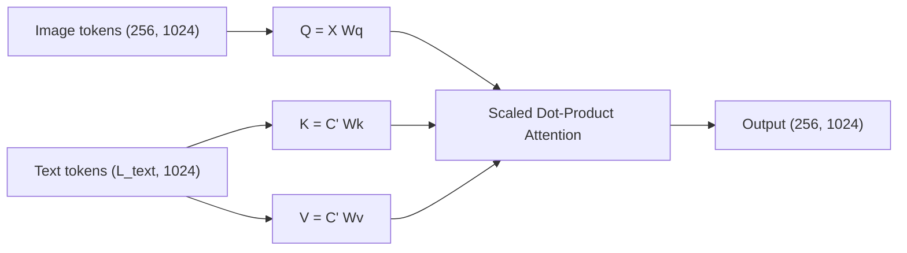
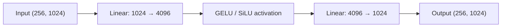
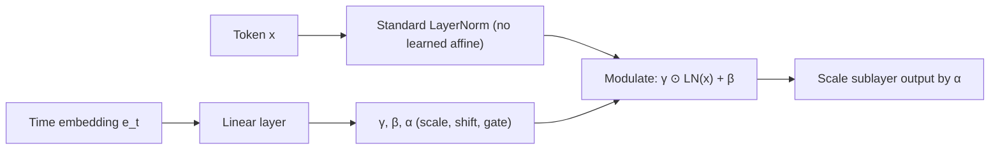

# Transformer Diffusion Model Architecture

## Table of Contents

1. [Introduction](#1-introduction)
2. [Overall Architecture](#2-overall-architecture)
3. [Block-by-Block Explanation](#3-block-by-block-explanation)
   - [3.1 Input Image](#31-input-image)
   - [3.2 Forward Diffusion](#32-forward-diffusion)
   - [3.3 Gaussian Noise](#33-gaussian-noise)
   - [3.4 Noise Schedule](#34-noise-schedule)
   - [3.5 Time Sampling](#35-time-sampling)
   - [3.6 Patchify](#36-patchify)
   - [3.7 Patch Embedding](#37-patch-embedding)
   - [3.8 Linear Projection (Patch Embedding Layer)](#38-linear-projection-patch-embedding-layer)
   - [3.9 Position Embedding](#39-position-embedding)
   - [3.10 Time Embedding](#310-time-embedding)
   - [3.11 Text Embedding](#311-text-embedding)
   - [3.12 Transformer Blocks](#312-transformer-blocks)
   - [3.13 Multi-Head Self-Attention](#313-multi-head-self-attention)
   - [3.14 Cross-Attention](#314-cross-attention)
   - [3.15 Feed Forward Network](#315-feed-forward-network)
   - [3.16 LayerNorm](#316-layernorm)
   - [3.17 AdaLN (Adaptive Layer Normalization)](#317-adaln-adaptive-layer-normalization)
   - [3.18 Residual Connections](#318-residual-connections)
   - [3.19 Final LayerNorm](#319-final-layernorm)
   - [3.20 Final Linear Projection](#320-final-linear-projection)
   - [3.21 Unpatchify](#321-unpatchify)
   - [3.22 Predicted Noise](#322-predicted-noise)
   - [3.23 Training Loss](#323-training-loss)
4. [Reverse Diffusion Process](#4-reverse-diffusion-process)
5. [How the Prediction Becomes an Image](#5-how-the-prediction-becomes-an-image)
6. [End-to-End Numerical Example](#6-end-to-end-numerical-example)
7. [Tensor Shape Summary](#7-tensor-shape-summary)
8. [Computational Complexity](#8-computational-complexity)
9. [Advantages and Limitations](#9-advantages-and-limitations)
10. [Conclusion](#10-conclusion)

---

# 1. Introduction

### What Is a Diffusion Model?

A **diffusion model** is a class of generative model that learns to produce data (typically images) by reversing a gradual noising process. The core idea is deceptively simple:

1. Take a clean data sample $x_0$ (e.g., a natural image).
2. Progressively corrupt it with Gaussian noise over $T$ discrete timesteps, producing a sequence $x_1, x_2, \dots, x_T$, where $x_T$ is approximately pure noise (**forward diffusion process**).
3. Train a neural network to reverse this process — i.e., to predict either the noise that was added, the original clean signal, or the "velocity" between clean and noisy states, at any given timestep $t$.
4. At generation time, start from pure Gaussian noise $x_T \sim \mathcal{N}(0, I)$ and iteratively apply the learned reverse process to arrive at a clean sample $x_0$ (**reverse diffusion / sampling process**).

Diffusion models are trained with a simple denoising objective (usually mean-squared error between predicted and true noise), which makes them significantly more stable to train than adversarial generative models such as GANs. They have become the dominant paradigm for high-fidelity image, video, and audio generation (e.g., DALL·E 2/3, Imagen, Stable Diffusion, Sora).

> **Key intuition:** A diffusion model does not learn to generate an image in one shot. It learns to *slightly denoise* an image, and by repeating this slight denoising many times, a coherent image emerges from pure noise — much like a sculptor removing small amounts of material at a time.

### What Is a Transformer?

A **Transformer** is a neural network architecture built entirely around the **attention mechanism**, introduced in *"Attention Is All You Need"* (Vaswani et al., 2017). Unlike convolutional networks, which process local neighborhoods of pixels, or recurrent networks, which process sequences step-by-step, Transformers process a sequence of tokens **in parallel**, allowing every token to directly attend to every other token via self-attention. This gives Transformers:

- **Global receptive field** from the very first layer (no need to stack many layers to see far-apart pixels, unlike CNNs).
- **Scalability**: Transformer performance tends to improve smoothly and predictably as model size, data, and compute increase (empirically observed "scaling laws").
- **Flexibility**: the same architecture can process images (by tokenizing into patches), text, audio, or multi-modal combinations, using the same core computational block.
- **Conditioning mechanisms**: attention naturally supports injecting side information (text, class labels, timestep) via cross-attention or adaptive normalization.

### Why Use Transformers for Diffusion Models?

Historically, diffusion models used a **U-Net** — a convolutional encoder-decoder with skip connections — as the noise-prediction network $\epsilon_\theta(x_t, t)$. U-Nets are effective but have architectural constraints: fixed downsampling/upsampling schedules, limited long-range interactions (bounded by convolutional receptive fields unless attention layers are manually inserted), and architecture-specific inductive biases that don't scale as cleanly with compute.

**Transformer-based diffusion models** (often called **Diffusion Transformers**, or **DiT**) replace the U-Net backbone with a plain Vision-Transformer-style backbone that operates on patch tokens. This is motivated by:

- **Scalability**: Transformers scale predictably with parameter count and data, following well-studied scaling laws, which U-Nets do not exhibit as cleanly.
- **Uniform architecture**: the same Transformer block (self-attention + cross-attention + MLP) can process image patches, text embeddings, and timestep embeddings uniformly, simplifying multi-modal conditioning.
- **Global context from layer 1**: every patch token can attend to every other patch token immediately, which is useful for maintaining global coherence (e.g., consistent lighting, structure, and object shapes across the whole image).
- **Simplicity of implementation**: no need to hand-design a U-Net's depth, skip connections, or channel multipliers — instead, depth/width can be scaled almost like a language model.
- **Empirical success**: DiT-style backbones underlie many state-of-the-art text-to-image and text-to-video systems.

### The Goal of This Architecture

The architecture documented here — a **Transformer Diffusion Model for image generation** — aims to:

1. Learn the reverse of a fixed, mathematically defined forward noising process.
2. Represent an image as a sequence of patch tokens so that a standard Transformer encoder can process it.
3. Condition the denoising prediction on the diffusion timestep $t$ (via time embeddings and AdaLN) and, optionally, on a text prompt (via cross-attention to text tokens from a pretrained text encoder such as CLIP or T5).
4. Predict the noise component $\hat\epsilon_\theta(x_t, t, c)$ that was added to the clean image, which is then used — together with a noise schedule — to iteratively denoise a randomly sampled Gaussian tensor into a coherent, prompt-consistent image.

The rest of this document explains, block by block, exactly how this pipeline is constructed, including tensor shapes, mathematical formulas, and design rationale.

---

# 2. Overall Architecture

The pipeline separates into two symmetric halves: a **forward (training-time, noise-adding) process** and a **reverse (inference-time, denoising) process**, connected by a shared neural network — the Diffusion Transformer.

### Pipeline Summary

| Stage | Purpose |
|---|---|
| **Training-time (top path)** | Add noise to real images at random timesteps, ask the Transformer to predict the added noise, and minimize the prediction error. |
| **Inference-time (bottom path)** | Start from pure noise and repeatedly call the trained Transformer to remove a small amount of noise at each step, eventually producing a clean image. |

The same neural network — the stack of Transformer blocks — is used in both the training and inference loop. Only the *usage pattern* differs: during training it is called once per image per batch (at a randomly sampled $t$); during inference it is called $T$ (or fewer, with samplers like DDIM) times sequentially on the same evolving latent $x_t$.

---

# 3. Block-by-Block Explanation

This section walks through **every block** in the architecture diagram, in the order data flows through the system. For each block we specify its purpose, its input tensor, its internal computation, the relevant mathematics, how tensor shapes change, its output, and the design rationale behind it.

Throughout this section we use a running numerical convention (elaborated fully in Section 6):

- Image resolution: $H = W = 256$, 3 channels (RGB)
- Patch size: $P = 16$
- Hidden (model) dimension: $d_{\text{model}} = 1024$
- Number of Transformer blocks: $L = 24$
- Number of attention heads: $n_{\text{heads}} = 16$ (so head dimension $d_h = 64$)
- Batch size: $B$

---

## 3.1 Input Image

### Purpose

The input image $x_0$ is the clean data sample the entire diffusion process is built around. During training, $x_0$ is a real image drawn from the training dataset. It serves as the ground-truth endpoint that the reverse process must be able to reconstruct.

### Input

| Property | Value |
|---|---|
| Shape | $(B, H, W, 3)$ = $(B, 256, 256, 3)$ |
| Type | `float32` (often normalized to $[-1, 1]$) |
| Data format | RGB raster image, channel-last or channel-first depending on framework |
| Meaning | A real photograph or artwork sampled from the training distribution |

### Internal Architecture

This block performs no learned computation. It typically includes only pre-processing:

- Resize / center-crop to the target resolution $(H, W)$.
- Normalize pixel values from $[0, 255]$ to $[-1, 1]$ via $x = \frac{\text{pixel}}{127.5} - 1$.
- Optionally encode into a compressed **latent space** using a pretrained VAE encoder (as in Latent Diffusion Models / Stable Diffusion), in which case $H, W$ refer to the latent spatial resolution (e.g., $32\times32\times4$ for a $256\times256$ image with an 8× downsampling VAE). This document assumes pixel-space diffusion for pedagogical clarity, but the same Transformer applies identically to VAE latents.

### Mathematical Operations

$$
x_0 \in \mathbb{R}^{H \times W \times 3}, \qquad x_0^{\text{norm}} = \frac{x_0}{127.5} - 1
$$

Here $x_0$ is the raw pixel tensor and $x_0^{\text{norm}}$ is the normalized tensor fed into the forward diffusion process.

### Tensor Shape Transformation

| Operation | Shape |
|---|---|
| Raw image | $(256, 256, 3)$ |
| Normalized image | $(256, 256, 3)$ |
| Batched | $(B, 256, 256, 3)$ |

### Output

A normalized floating-point tensor $x_0^{\text{norm}}$ of shape $(B, 256, 256, 3)$, ready to be corrupted by the forward diffusion process.

### Why This Design?

Normalizing to $[-1, 1]$ matches the scale of standard Gaussian noise ($\mathcal{N}(0, 1)$) that will be added during forward diffusion, so that the signal-to-noise ratio schedule behaves predictably across timesteps. Operating in a compressed latent space (VAE) instead of raw pixels — as popularized by Latent Diffusion Models — dramatically reduces compute, since the Transformer then only needs to process a much smaller spatial grid.

---

## 3.2 Forward Diffusion

### Purpose

Forward diffusion defines a fixed (non-learned) Markov chain that gradually destroys the structure of $x_0$ by adding Gaussian noise, until $x_T$ is indistinguishable from pure noise. This is the process the network must learn to invert.

### Input

| Property | Value |
|---|---|
| Shape | $(B, 256, 256, 3)$ |
| Type | `float32` |
| Description | Clean image $x_0$, plus a noise schedule $\{\beta_t\}_{t=1}^{T}$ |

### Internal Architecture

Forward diffusion is defined as a chain of $T$ Gaussian transitions:

$$
q(x_t \mid x_{t-1}) = \mathcal{N}\left(x_t;\ \sqrt{1-\beta_t}\, x_{t-1},\ \beta_t I\right)
$$

Because the composition of Gaussians is itself Gaussian, this chain has a closed-form expression that lets us jump directly from $x_0$ to any $x_t$ without simulating all intermediate steps:

$$
q(x_t \mid x_0) = \mathcal{N}\left(x_t;\ \sqrt{\bar\alpha_t}\, x_0,\ (1-\bar\alpha_t) I\right)
$$

where $\alpha_t = 1 - \beta_t$ and $\bar\alpha_t = \prod_{s=1}^{t} \alpha_s$.

### Mathematical Operations

The reparameterized sampling formula used in practice:

$$
x_t = \sqrt{\bar\alpha_t}\, x_0 + \sqrt{1-\bar\alpha_t}\, \epsilon, \qquad \epsilon \sim \mathcal{N}(0, I)
$$

**Variable definitions:**

- $x_0$: the clean image.
- $x_t$: the noisy image at timestep $t$.
- $\epsilon$: standard Gaussian noise, same shape as $x_0$, this is the target the network will learn to predict.
- $\bar\alpha_t \in (0, 1)$: cumulative product of $(1-\beta_s)$ terms up to step $t$; it monotonically decreases from near $1$ (at $t=0$, almost no noise) to near $0$ (at $t=T$, almost pure noise).
- $\sqrt{\bar\alpha_t}$: the "signal retention" coefficient.
- $\sqrt{1-\bar\alpha_t}$: the "noise injection" coefficient.

### Tensor Shape Transformation

| Operation | Shape |
|---|---|
| Input $x_0$ | $(B, 256, 256, 3)$ |
| Sampled noise $\epsilon$ | $(B, 256, 256, 3)$ |
| Output $x_t$ | $(B, 256, 256, 3)$ |

The shape never changes — only the pixel statistics change, becoming progressively more Gaussian-like as $t \to T$.

### Output

$x_t$: a noisy version of the image at a specific timestep $t$, and the exact noise $\epsilon$ used to create it (needed later as the training target).

### Why This Design?

The closed-form single-step sampling formula is what makes diffusion model training efficient: instead of iterating through $t$ sequential noising steps for every training example, we sample $t$ uniformly at random and jump directly to $x_t$ in one computation. This turns an inherently sequential process into an embarrassingly parallel training procedure.

---

## 3.3 Gaussian Noise

### Purpose

Gaussian noise $\epsilon$ is both the corrupting signal added during the forward process and the **training target** the network must learn to predict. Using i.i.d. standard Gaussian noise (rather than, say, uniform or structured noise) gives the diffusion process convenient closed-form marginal and posterior distributions.

### Input

| Property | Value |
|---|---|
| Shape | $(B, 256, 256, 3)$ |
| Type | `float32` |
| Description | Random tensor sampled once per training example |

### Internal Architecture

No learned parameters. Simply an i.i.d. sample:

$$
\epsilon \sim \mathcal{N}(0, I), \qquad \epsilon_{i,j,c} \overset{\text{i.i.d.}}{\sim} \mathcal{N}(0, 1)
$$

### Mathematical Operations

Each scalar entry of $\epsilon$ is drawn independently from a standard normal distribution with mean $0$ and variance $1$. The full tensor is therefore an isotropic Gaussian in $\mathbb{R}^{H\times W\times 3}$.

### Tensor Shape Transformation

| Operation | Shape |
|---|---|
| Sampled noise | $(256, 256, 3)$ |
| Batched | $(B, 256, 256, 3)$ |

### Output

$\epsilon$, used (a) to construct $x_t$ in the forward process, and (b) as the ground-truth regression target for the network's prediction $\hat\epsilon_\theta$.

### Why This Design?

Gaussian noise is mathematically convenient: sums and scaled combinations of Gaussians remain Gaussian, which is what allows the closed-form forward marginal $q(x_t|x_0)$ and the tractable reverse posterior $q(x_{t-1}|x_t,x_0)$ used to derive the training loss (Section 3.23) and the sampling equation (Section 4).

---

## 3.4 Noise Schedule

### Purpose

The noise schedule $\{\beta_t\}_{t=1}^T$ controls **how quickly** signal is destroyed as $t$ increases. It is a fixed (usually not learned) hyperparameter schedule that critically affects sample quality and training stability.

### Input

| Property | Value |
|---|---|
| Shape | $(T,)$ — a 1D schedule vector |
| Type | `float32` |
| Description | Per-timestep noise variance values |

### Internal Architecture

Common schedule choices:

- **Linear schedule**: $\beta_t$ increases linearly from $\beta_1 = 10^{-4}$ to $\beta_T = 0.02$.
- **Cosine schedule** (Nichol & Dhariwal, 2021): defines $\bar\alpha_t$ directly via a cosine curve, giving a smoother signal-to-noise decay, especially near $t=0$ and $t=T$, which improves sample quality:

$$
\bar\alpha_t = \frac{f(t)}{f(0)}, \qquad f(t) = \cos\left(\frac{t/T + s}{1+s}\cdot\frac{\pi}{2}\right)^2
$$

where $s$ is a small offset (e.g., $0.008$) preventing $\beta_t$ from being too small near $t=0$.

### Mathematical Operations

$$
\alpha_t = 1 - \beta_t, \qquad \bar\alpha_t = \prod_{s=1}^{t}\alpha_s
$$

- $\beta_t$: variance added at diffusion step $t$.
- $\alpha_t$: fraction of signal retained at step $t$.
- $\bar\alpha_t$: cumulative signal retention from step $1$ through $t$, used directly in the closed-form forward sampling formula.

### Tensor Shape Transformation

| Operation | Shape |
|---|---|
| $\beta_t$ schedule | $(T,)$ |
| $\alpha_t$ | $(T,)$ |
| $\bar\alpha_t$ | $(T,)$ |

These are precomputed once (not per-batch) and indexed at training/sampling time.

### Output

Lookup tables $\beta_t, \alpha_t, \bar\alpha_t$ for $t = 1, \dots, T$, used throughout both forward and reverse diffusion computations.

### Why This Design?

The schedule shape directly determines how much of training/sampling "effort" is spent on different noise levels. A schedule that spends too many steps near-fully-noised or near-fully-clean wastes capacity; the cosine schedule was specifically designed to avoid destroying information too quickly at low $t$, improving perceptual quality in the resulting model.

---

## 3.5 Time Sampling

### Purpose

During training, rather than iterating through every timestep sequentially, a single timestep $t$ is sampled uniformly at random per training example. This is what makes diffusion training efficient and parallelizable across a batch.

### Input

| Property | Value |
|---|---|
| Shape | scalar (or $(B,)$ for a batch) |
| Type | `int64` |
| Description | Random integer timestep index |

### Internal Architecture

$$
t \sim \text{Uniform}\{1, 2, \dots, T\}
$$

Each example in the batch typically gets an **independently sampled** $t$, so a single batch contains a diverse mixture of noise levels — this stabilizes gradients and ensures the network learns to denoise well across the entire range of $t$.

### Mathematical Operations

No transformation of data; this is purely a sampling operation over the discrete uniform distribution on $\{1,\dots,T\}$.

### Tensor Shape Transformation

| Operation | Shape |
|---|---|
| Sampled $t$ per example | $(B,)$ |

### Output

A batch of integer timesteps $t \in \{1,\dots,T\}^B$, used to (a) index the noise schedule for the forward process, and (b) compute the time embedding $e_t$ that conditions the network.

### Why This Design?

Random uniform sampling of $t$ ensures unbiased coverage of the entire noise spectrum during training, so the single shared network $\epsilon_\theta(x_t, t, c)$ learns to handle noise levels from nearly-clean to nearly-pure-noise equally well. Some implementations use importance sampling over $t$ (weighting the loss by timestep) to reduce variance, but uniform sampling is the standard baseline.

---

## 3.6 Patchify

### Purpose

Transformers operate on sequences of tokens, not 2D grids. Patchify converts the noisy image $x_t$ into a sequence of flattened, non-overlapping square patches, following the same tokenization strategy used in Vision Transformers (ViT).

### Input

| Property | Value |
|---|---|
| Shape | $(B, 256, 256, 3)$ |
| Type | `float32` |
| Description | Noisy image $x_t$ |

### Internal Architecture

The image is divided into a grid of non-overlapping $P \times P$ patches. With $H=W=256$ and $P=16$:

$$
N = \left(\frac{H}{P}\right) \times \left(\frac{W}{P}\right) = \left(\frac{256}{16}\right)\times\left(\frac{256}{16}\right) = 16 \times 16 = 256 \text{ patches}
$$

Each patch has $P \times P \times 3 = 16 \times 16 \times 3 = 768$ pixel values, which are flattened into a single vector.

### Mathematical Operations

$$
x_t \in \mathbb{R}^{H\times W \times 3} \longrightarrow \{p_i\}_{i=1}^{N}, \quad p_i \in \mathbb{R}^{P^2 \cdot 3}
$$

Each $p_i$ is the flattened pixel content of the $i$-th spatial patch; $i$ indexes patches in raster-scan (row-major) order.

### Tensor Shape Transformation

| Operation | Shape |
|---|---|
| Input image | $(256, 256, 3)$ |
| Patch grid | $(16, 16, 16, 16, 3)$ (patches along H, patches along W, patch H, patch W, channels) |
| Flattened patches | $(256, 768)$ |

### Output

A sequence of $N=256$ flattened patch vectors, each of dimension $768$, shape $(B, 256, 768)$.

### Why This Design?

Patchify is the bridge between the 2D convolutional world and the 1D-sequence Transformer world. Choosing a patch size trades off sequence length against per-token information: smaller patches (e.g., $P=8$) yield more tokens (finer spatial resolution, higher compute due to attention's quadratic cost), while larger patches (e.g., $P=32$) yield fewer, coarser tokens (cheaper, but less spatial precision).

---

## 3.7 Patch Embedding

### Purpose

Patch Embedding refers to the overall step of turning raw flattened patches into token vectors that live in the Transformer's working (hidden) dimension $d_{\text{model}}$, so they can be processed alongside time and text embeddings of the same dimensionality.

### Input

| Property | Value |
|---|---|
| Shape | $(B, 256, 768)$ |
| Type | `float32` |
| Description | Flattened raw patches from Patchify |

### Internal Architecture

Conceptually this block *is* the linear projection described next (Section 3.8) — in the architecture diagram, "Patch Embedding" is the umbrella label for "flatten patch → project to $d_{\text{model}}$." In practice it is implemented as a single linear layer (equivalently, a strided convolution with kernel size and stride equal to $P$).

### Mathematical Operations

$$
z_i = W_e\, p_i + b_e, \qquad W_e \in \mathbb{R}^{d_{\text{model}} \times (P^2\cdot 3)},\ b_e \in \mathbb{R}^{d_{\text{model}}}
$$

- $p_i$: the $i$-th flattened raw patch, dimension $768$.
- $W_e, b_e$: learned projection weight and bias.
- $z_i$: the resulting patch embedding (token), dimension $d_{\text{model}} = 1024$.

### Tensor Shape Transformation

| Operation | Shape |
|---|---|
| Flattened patches | $(256, 768)$ |
| Patch embeddings | $(256, 1024)$ |

### Output

A sequence of $N=256$ token embeddings, each of dimension $d_{\text{model}}=1024$: shape $(B, 256, 1024)$.

### Why This Design?

Projecting into a shared embedding dimension allows patch tokens to be summed with position embeddings and processed by the same Transformer blocks that also receive time and (via cross-attention) text information — all of these must ultimately live in comparable vector spaces for attention and residual addition to be meaningful.

---

## 3.8 Linear Projection (Patch Embedding Layer)

### Purpose

This is the specific learned layer that performs the patch-to-token projection described conceptually above. It is listed separately in the architecture because the same "linear projection" primitive recurs at multiple points in the network (patch embedding, and later the final projection back to pixel space).

### Input

| Property | Value |
|---|---|
| Shape | $(B, 256, 768)$ |
| Type | `float32` |
| Description | Flattened patch vectors |

### Internal Architecture

A single dense (fully-connected) layer applied identically (with shared weights) to every patch position — equivalent to a $1\times1$ convolution over the patch-grid representation, or a Conv2D with kernel size $P$ and stride $P$ applied directly to the image.

### Mathematical Operations

$$
Z = P\, W_e^\top + \mathbf{1}\,b_e^\top, \qquad P \in \mathbb{R}^{N \times (P^2\cdot3)},\ Z \in \mathbb{R}^{N\times d_{\text{model}}}
$$

Here $P$ (bold, the patch matrix — not to be confused with the patch size scalar $P$) stacks all $N$ flattened patches as rows, and $Z$ stacks all resulting token embeddings as rows.

### Tensor Shape Transformation

| Operation | Shape |
|---|---|
| Input | $(256, 768)$ |
| Weight matrix | $(1024, 768)$ |
| Output | $(256, 1024)$ |

### Output

Token matrix $Z \in \mathbb{R}^{256\times1024}$ (per image), batched as $(B, 256, 1024)$.

### Why This Design?

A linear projection is the simplest possible parametric map between the raw patch space and the model's hidden space, and it is fully differentiable and cheap ($O(N \cdot d_{\text{model}} \cdot P^2 \cdot 3)$ FLOPs) relative to the subsequent attention layers.

---

## 3.9 Position Embedding

### Purpose

Self-attention is **permutation-invariant** — without additional information, the Transformer cannot tell that patch $5$ is spatially adjacent to patch $6$ but far from patch $200$. Position embeddings inject spatial location information into each token.

### Input

| Property | Value |
|---|---|
| Shape | $(B, 256, 1024)$ |
| Type | `float32` |
| Description | Patch token embeddings (pre-position-encoding) |

### Internal Architecture

Two common variants:

- **Learnable position embeddings**: a trainable parameter matrix $E_{\text{pos}} \in \mathbb{R}^{N\times d_{\text{model}}}$, one row per patch position, added directly to the token embeddings.
- **Sinusoidal (fixed) 2D position embeddings**: deterministic functions of the patch's row and column index, using sine/cosine functions at multiple frequencies — often computed separately for row and column and concatenated, to encode genuine 2D spatial structure.

### Mathematical Operations

Learnable case:

$$
z_i' = z_i + E_{\text{pos}}[i]
$$

Sinusoidal case (for a 1D index example, extendable to 2D by concatenating row/column encodings):

$$
E_{\text{pos}}(i, 2k) = \sin\left(\frac{i}{10000^{2k/d}}\right), \qquad E_{\text{pos}}(i, 2k+1) = \cos\left(\frac{i}{10000^{2k/d}}\right)
$$

- $i$: patch index (position in the sequence).
- $k$: dimension index pair.
- $d$: embedding dimension.

### Tensor Shape Transformation

| Operation | Shape |
|---|---|
| Token embeddings | $(256, 1024)$ |
| Position embedding table | $(256, 1024)$ |
| Sum (output) | $(256, 1024)$ |

### Output

Position-aware token embeddings, shape $(B, 256, 1024)$ — same shape as input, values shifted to encode spatial location.

### Why This Design?

Without positional information, shuffling all 256 patches would produce an identical Transformer output — clearly undesirable for image generation, where spatial arrangement is the entire point. Learnable embeddings tend to perform slightly better in-distribution but do not generalize to unseen resolutions; sinusoidal (or more modern rotary/2D-RoPE) embeddings generalize more gracefully to different image sizes.

---

## 3.10 Time Embedding

### Purpose

The Transformer must know **which noise level** it is currently denoising, since the optimal denoising behavior differs drastically between $t \approx T$ (mostly noise, focus on global structure) and $t \approx 0$ (mostly signal, focus on fine detail). The time embedding encodes the scalar timestep $t$ into a rich vector that conditions every Transformer block.

### Input

| Property | Value |
|---|---|
| Shape | $(B,)$ |
| Type | `int64` → converted to `float32` |
| Description | Diffusion timestep index |

### Internal Architecture

1. **Sinusoidal encoding** of the scalar $t$ (same functional form as Transformer positional encodings, but applied to the timestep rather than sequence position), producing a fixed-size vector.
2. A small **MLP** (typically two linear layers with a SiLU/GELU nonlinearity in between) projects this sinusoidal vector into the model's conditioning dimension.

### Mathematical Operations

$$
\phi(t)_{2k} = \sin\left(\frac{t}{10000^{2k/d}}\right), \qquad \phi(t)_{2k+1} = \cos\left(\frac{t}{10000^{2k/d}}\right)
$$

$$
e_t = W_2\,\sigma\!\big(W_1\,\phi(t) + b_1\big) + b_2
$$

- $\phi(t)$: fixed sinusoidal features of the scalar $t$.
- $W_1, W_2, b_1, b_2$: learned MLP parameters.
- $\sigma(\cdot)$: nonlinearity (commonly SiLU, i.e., $x\cdot\text{sigmoid}(x)$).
- $e_t$: final time embedding vector, dimension $d_{\text{model}}$ (or a separate conditioning dimension $d_c$).

### Tensor Shape Transformation

| Operation | Shape |
|---|---|
| Scalar $t$ | $(1,)$ |
| Sinusoidal features $\phi(t)$ | $(256,)$ (example frequency count) |
| After MLP | $(1024,)$ |
| Batched | $(B, 1024)$ |

### Output

A per-example time embedding $e_t \in \mathbb{R}^{1024}$, shape $(B, 1024)$, broadcast to every Transformer block as the conditioning signal for AdaLN.

### Why This Design?

Encoding $t$ sinusoidally (rather than feeding the raw integer directly) gives the network a smooth, high-dimensional representation where nearby timesteps have similar embeddings and the network can easily learn both coarse and fine-grained dependence on noise level — analogous to why positional encodings are used instead of raw integer indices in standard Transformers.

---

## 3.11 Text Embedding

### Purpose

For text-to-image generation, the model must be conditioned on a natural-language prompt (e.g., *"a sunset over mountains"*). The text embedding block converts the prompt into a sequence of token embeddings that the image tokens can attend to via cross-attention.

### Input

| Property | Value |
|---|---|
| Shape | string (variable length), tokenized to $(B, L_{\text{text}})$ |
| Type | token IDs (`int64`) |
| Description | Natural language prompt |

### Internal Architecture

A **pretrained, typically frozen** text encoder — such as CLIP's text tower or a T5 encoder — tokenizes and encodes the prompt into a sequence of contextualized embeddings. Optionally, a small trainable projection layer maps the text encoder's output dimension to the diffusion Transformer's cross-attention dimension.

### Mathematical Operations

$$
C = \text{TextEncoder}(\text{tokenize}(\text{prompt})) \in \mathbb{R}^{L_{\text{text}} \times d_{\text{text}}}
$$

$$
C' = C\,W_{\text{proj}}, \qquad W_{\text{proj}} \in \mathbb{R}^{d_{\text{text}} \times d_{\text{model}}}
$$

- $L_{\text{text}}$: number of text tokens (e.g., 77 for CLIP, up to hundreds for T5).
- $d_{\text{text}}$: the text encoder's native embedding dimension.
- $C'$: text embeddings projected into the diffusion model's dimension, ready for cross-attention.

### Tensor Shape Transformation

| Operation | Shape |
|---|---|
| Tokenized prompt | $(L_{\text{text}},)$ |
| Text encoder output | $(L_{\text{text}}, d_{\text{text}})$ |
| Projected text tokens | $(L_{\text{text}}, 1024)$ |
| Batched | $(B, L_{\text{text}}, 1024)$ |

### Output

A sequence of projected text embeddings, shape $(B, L_{\text{text}}, 1024)$, used as the key/value source in every cross-attention layer.

### Why This Design?

Using a **pretrained** text encoder leverages large-scale language/vision-language pretraining without having to learn language understanding from scratch on (typically much smaller) image-caption datasets. Keeping it frozen (common practice) also reduces training cost and preserves robust, generalizable language representations, while only the small projection layer and the diffusion Transformer itself are trained to interpret those representations for image synthesis.

---

## 3.12 Transformer Blocks

### Purpose

The Transformer blocks are the computational core of the model — a stack of $L$ identical blocks that iteratively refine the patch token representations, incorporating spatial self-attention, text conditioning (cross-attention), and timestep conditioning (AdaLN), ultimately producing representations from which noise can be predicted.

### Input

| Property | Value |
|---|---|
| Shape | $(B, 256, 1024)$ image tokens; $(B, 1024)$ time embedding; $(B, L_{\text{text}}, 1024)$ text tokens |
| Type | `float32` |
| Description | Position-embedded patch tokens plus conditioning signals |

### Internal Architecture

Each of the $L=24$ blocks follows this internal structure (matching the diagram):

Each block therefore contains, in order:
1. AdaLN → Self-Attention → residual add
2. AdaLN → Cross-Attention (to text) → residual add
3. Feed-forward MLP → residual add

### Mathematical Operations

$$
h = x + \text{MSA}\big(\text{AdaLN}(x, e_t)\big)
$$

$$
h' = h + \text{CrossAttn}\big(\text{AdaLN}(h, e_t),\ C'\big)
$$

$$
x_{\text{out}} = h' + \text{MLP}\big(\text{LN}(h')\big)
$$

- $x$: input token sequence to the block.
- $e_t$: time embedding, modulating the AdaLN parameters.
- $C'$: projected text token sequence, used as keys/values in cross-attention.
- $x_{\text{out}}$: output token sequence, passed to the next block.

### Tensor Shape Transformation

| Operation | Shape |
|---|---|
| Block input | $(256, 1024)$ |
| After self-attention + residual | $(256, 1024)$ |
| After cross-attention + residual | $(256, 1024)$ |
| After MLP + residual | $(256, 1024)$ |
| Block output | $(256, 1024)$ |

Shape is preserved across the entire block — this is a defining property of Transformer blocks, which enables stacking arbitrarily many of them.

### Output

Refined token sequence, shape $(B, 256, 1024)$, passed either to the next Transformer block or, after the final block, to the output head.

### Why This Design?

Stacking many identical residual blocks allows the network to iteratively refine its representation — early blocks may capture coarse global structure (especially important at high noise levels), while later blocks refine fine detail. Shape preservation through the stack means depth $L$ can be scaled up or down independently of any other architectural choice, which is a major reason Transformers scale so cleanly with compute.

---

## 3.13 Multi-Head Self-Attention

### Purpose

Self-attention allows every patch token to gather information from every other patch token, weighted by learned relevance ("attention") scores. This gives the model a global receptive field within a single layer, critical for maintaining long-range spatial consistency in the generated image.

### Input

| Property | Value |
|---|---|
| Shape | $(B, 256, 1024)$ |
| Type | `float32` |
| Description | Normalized token sequence (post-AdaLN) |

### Internal Architecture

1. Linearly project the input into Query, Key, and Value matrices.
2. Split each into $n_{\text{heads}}$ heads of dimension $d_h = d_{\text{model}}/n_{\text{heads}}$.
3. Compute scaled dot-product attention independently per head.
4. Concatenate heads and apply an output projection.

### Mathematical Operations

$$
Q = X W_Q,\quad K = X W_K,\quad V = X W_V
$$

$$
\text{Attention}(Q,K,V) = \text{softmax}\left(\frac{QK^\top}{\sqrt{d_h}}\right)V
$$

$$
\text{MSA}(X) = \text{Concat}(\text{head}_1, \dots, \text{head}_{n_{\text{heads}}})\,W_O
$$

- $X \in \mathbb{R}^{N\times d_{\text{model}}}$: input token matrix.
- $W_Q, W_K, W_V \in \mathbb{R}^{d_{\text{model}}\times d_{\text{model}}}$: learned projection matrices.
- $Q, K, V$: query, key, and value matrices.
- $d_h$: per-head dimension; $\sqrt{d_h}$ is the scaling factor preventing dot products from growing too large in magnitude (which would push softmax into saturated, low-gradient regions).
- $\text{softmax}(QK^\top/\sqrt{d_h})$: attention weight matrix, shape $(N, N)$, each row sums to 1.
- $W_O \in \mathbb{R}^{d_{\text{model}}\times d_{\text{model}}}$: output projection recombining heads.

### Tensor Shape Transformation

| Operation | Shape |
|---|---|
| Input $X$ | $(256, 1024)$ |
| $Q, K, V$ | $(256, 1024)$ each |
| Per-head $Q,K,V$ | $(16, 256, 64)$ |
| Attention scores $QK^\top$ | $(16, 256, 256)$ |
| Weighted values | $(16, 256, 64)$ |
| Concatenated heads | $(256, 1024)$ |
| Output projection | $(256, 1024)$ |

### Output

A token sequence of the same shape as the input, $(B, 256, 1024)$, where each token's representation now incorporates weighted information from all other patch tokens.

### Why This Design?

Multiple heads allow the model to attend to different types of relationships simultaneously (e.g., one head might specialize in color consistency, another in edge/structure continuity, another in long-range compositional layout). The scaling factor $1/\sqrt{d_h}$ is essential for stable gradients as $d_h$ grows. The quadratic $O(N^2)$ cost of the attention matrix is the price paid for this global receptive field, and is the primary computational bottleneck discussed in Section 8.

---

## 3.14 Cross-Attention

### Purpose

Cross-attention lets the image patch tokens (queries) attend to the text prompt tokens (keys/values), injecting semantic conditioning information from the text into the visual representation — this is how the network learns to generate an image that matches the prompt.

### Input

| Property | Value |
|---|---|
| Shape | Queries: $(B, 256, 1024)$; Keys/Values: $(B, L_{\text{text}}, 1024)$ |
| Type | `float32` |
| Description | Normalized image tokens (queries) and projected text tokens (keys/values) |

### Internal Architecture

Identical mechanism to self-attention, except the Key and Value projections are applied to the **text** token sequence $C'$ rather than the image token sequence:

### Mathematical Operations

$$
Q = X W_Q,\qquad K = C' W_K,\qquad V = C' W_V
$$

$$
\text{CrossAttn}(X, C') = \text{softmax}\left(\frac{QK^\top}{\sqrt{d_h}}\right)V
$$

- $X$: image token queries, $N=256$ rows.
- $C'$: text token keys/values, $L_{\text{text}}$ rows.
- The attention matrix $QK^\top$ is now **rectangular**, shape $(N, L_{\text{text}})$, since queries and keys come from sequences of different lengths.

### Tensor Shape Transformation

| Operation | Shape |
|---|---|
| Image queries $Q$ | $(256, 1024)$ |
| Text keys $K$ | $(L_{\text{text}}, 1024)$ |
| Text values $V$ | $(L_{\text{text}}, 1024)$ |
| Attention scores | $(256, L_{\text{text}})$ |
| Output | $(256, 1024)$ |

### Output

Image token sequence of shape $(B, 256, 1024)$, now enriched with semantically relevant information pulled from the text prompt (e.g., patches corresponding to sky regions attend strongly to the word "sunset").

### Why This Design?

Cross-attention is a natural mechanism for conditioning one modality (image) on another (text) without requiring them to share a sequence length or spatial structure. It generalizes readily to other conditioning signals (e.g., class labels represented as single tokens, or reference images), which is part of why Transformer-based diffusion architectures are considered flexible multi-modal backbones.

---

## 3.15 Feed Forward Network

### Purpose

While attention mixes information *across* tokens, the feed-forward network (FFN / MLP) processes each token **independently**, applying a nonlinear transformation that increases the model's representational capacity.

### Input

| Property | Value |
|---|---|
| Shape | $(B, 256, 1024)$ |
| Type | `float32` |
| Description | Output of the (cross-)attention + residual sub-layer |

### Internal Architecture

A two-layer MLP with an expansion ratio (commonly 4×) and a nonlinearity (GELU or SiLU) in between:

### Mathematical Operations

$$
\text{FFN}(x) = W_2\,\sigma(W_1 x + b_1) + b_2
$$

- $W_1 \in \mathbb{R}^{4d_{\text{model}}\times d_{\text{model}}}$, $W_2 \in \mathbb{R}^{d_{\text{model}}\times 4d_{\text{model}}}$: learned weight matrices.
- $\sigma$: nonlinearity, typically GELU: $\text{GELU}(x) = x\cdot\Phi(x)$, where $\Phi$ is the standard Gaussian CDF.
- Applied identically (with shared weights) to each of the $N$ tokens independently.

### Tensor Shape Transformation

| Operation | Shape |
|---|---|
| Input | $(256, 1024)$ |
| After first linear layer | $(256, 4096)$ |
| After activation | $(256, 4096)$ |
| After second linear layer | $(256, 1024)$ |

### Output

Token sequence of shape $(B, 256, 1024)$ — same shape as input, with each token's features nonlinearly transformed.

### Why This Design?

The attention sub-layer is fundamentally a (data-dependent) linear recombination of value vectors; without an interleaved nonlinear per-token transformation, the network's expressive power would be severely limited. The 4× expansion ratio is an empirically effective trade-off between capacity and compute, first popularized in the original Transformer paper and retained across most subsequent architectures.

---

## 3.16 LayerNorm

### Purpose

Layer Normalization stabilizes training by normalizing the activations of each token independently across the feature dimension, reducing internal covariate shift and allowing much deeper networks to train reliably.

### Input

| Property | Value |
|---|---|
| Shape | $(B, 256, 1024)$ |
| Type | `float32` |
| Description | Pre-normalization token activations |

### Internal Architecture

For each token vector $x \in \mathbb{R}^{d_{\text{model}}}$, compute its mean and variance across the feature dimension, normalize, then apply a learned affine transform (scale $\gamma$, shift $\beta$):

### Mathematical Operations

$$
\mu = \frac{1}{d}\sum_{j=1}^{d} x_j, \qquad \sigma^2 = \frac{1}{d}\sum_{j=1}^{d}(x_j-\mu)^2
$$

$$
\text{LN}(x) = \gamma\odot\frac{x-\mu}{\sqrt{\sigma^2+\epsilon}} + \beta
$$

- $\mu, \sigma^2$: per-token mean and variance across the $d_{\text{model}}$ features.
- $\gamma, \beta \in \mathbb{R}^{d_{\text{model}}}$: learned scale and shift parameters (shared across tokens and positions).
- $\epsilon$: small constant for numerical stability (not to be confused with the diffusion noise $\epsilon$).

### Tensor Shape Transformation

| Operation | Shape |
|---|---|
| Input | $(256, 1024)$ |
| Output | $(256, 1024)$ |

Shape-preserving; only per-token statistics change.

### Output

Normalized token sequence of shape $(B, 256, 1024)$, with each token individually zero-centered and unit-variance (before the learned affine transform).

### Why This Design?

Normalizing across the feature dimension (rather than across the batch, as in BatchNorm) makes LayerNorm's statistics independent of batch composition and sequence position, which is essential for Transformers that must handle variable batch sizes and sequence lengths robustly, and for stable training with attention.

---

## 3.17 AdaLN (Adaptive Layer Normalization)

### Purpose

Standard LayerNorm uses a single, fixed $(\gamma,\beta)$ pair learned during training. **AdaLN** instead predicts $(\gamma,\beta)$ (and optionally a residual gating scalar $\alpha$) *dynamically*, as a function of the conditioning signal — here, the timestep embedding $e_t$. This is the primary mechanism by which the diffusion timestep modulates every Transformer block's behavior.

### Input

| Property | Value |
|---|---|
| Shape | Tokens: $(B, 256, 1024)$; Conditioning: $(B, 1024)$ |
| Type | `float32` |
| Description | Token activations and the time embedding $e_t$ |

### Internal Architecture

A small linear layer maps the conditioning vector $e_t$ to per-channel scale, shift, and (in the "AdaLN-Zero" variant popularized by DiT) gating parameters:

### Mathematical Operations

$$
[\gamma, \beta, \alpha] = W_{\text{ada}}\, e_t + b_{\text{ada}}
$$

$$
\text{AdaLN}(x, e_t) = \gamma \odot \text{LN}_{\text{no-affine}}(x) + \beta
$$

$$
x_{\text{out}} = x + \alpha \odot \text{Sublayer}\big(\text{AdaLN}(x, e_t)\big)
$$

- $e_t$: time embedding (Section 3.10), sometimes summed with a class/text pooled embedding.
- $\gamma, \beta$: dynamically predicted per-channel scale and shift, replacing LayerNorm's usual fixed learned parameters.
- $\alpha$: a learned gating scalar (per channel) applied to the sublayer's output before the residual add — in "AdaLN-Zero," $\alpha$ is initialized to output zero, so each block initially behaves as the identity function, greatly stabilizing early training.
- $\text{Sublayer}$: the self-attention, cross-attention, or MLP block being modulated.

### Tensor Shape Transformation

| Operation | Shape |
|---|---|
| Time embedding $e_t$ | $(1024,)$ |
| Predicted $(\gamma,\beta,\alpha)$ | $(1024,)$ each |
| Normalized tokens | $(256, 1024)$ |
| Modulated tokens | $(256, 1024)$ |

### Output

Modulated token sequence, shape $(B, 256, 1024)$, whose normalization statistics are now conditioned on the current diffusion timestep (and, in many implementations, jointly on pooled text/class embeddings).

### Why This Design?

Diffusion models must behave very differently at different noise levels using the *same* set of weights. AdaLN provides an efficient, low-parameter mechanism for the timestep (a single scalar-derived embedding) to globally reconfigure the behavior of every layer in the network, without needing separate weights per timestep. The "zero-init" gating trick additionally makes very deep Transformer diffusion models trainable from scratch, a key insight from the DiT architecture.

---

## 3.18 Residual Connections

### Purpose

Residual (skip) connections add each sublayer's input directly to its output, allowing gradients to flow unimpeded through very deep networks and allowing each sublayer to learn a small *refinement* rather than a full re-representation.

### Input

| Property | Value |
|---|---|
| Shape | $(B, 256, 1024)$ (both the sublayer input and its output) |
| Type | `float32` |
| Description | Pre-sublayer token sequence and post-sublayer token sequence |

### Internal Architecture

A simple element-wise addition, optionally scaled by a learned gate $\alpha$ (from AdaLN-Zero):

### Mathematical Operations

$$
x_{\text{out}} = x_{\text{in}} + \alpha \odot F(x_{\text{in}})
$$

- $x_{\text{in}}$: input to the sublayer (attention or MLP).
- $F(x_{\text{in}})$: the sublayer's transformation.
- $\alpha$: optional learned per-channel gate (defaults to $1$ if not using AdaLN-Zero).

### Tensor Shape Transformation

| Operation | Shape |
|---|---|
| $x_{\text{in}}$ | $(256, 1024)$ |
| $F(x_{\text{in}})$ | $(256, 1024)$ |
| $x_{\text{out}}$ | $(256, 1024)$ |

### Output

Token sequence with the sublayer's contribution added back to its input, shape $(B, 256, 1024)$, unchanged in shape but refined in content.

### Why This Design?

Without residual connections, gradients in very deep networks (here, $L=24$ blocks × 3 sublayers each = 72 sequential nonlinear transformations) tend to vanish or explode. Residual connections create a direct gradient "highway" from the output back to every layer, a critical ingredient in making both deep CNNs (ResNet) and deep Transformers trainable.

---

## 3.19 Final LayerNorm

### Purpose

After all $L$ Transformer blocks, a final normalization step (again typically an AdaLN, conditioned on $e_t$) stabilizes the representation immediately before the output projection converts tokens back into pixel-space predictions.

### Input

| Property | Value |
|---|---|
| Shape | $(B, 256, 1024)$ |
| Type | `float32` |
| Description | Output of the last Transformer block |

### Internal Architecture

Identical mechanism to Section 3.17 (AdaLN), applied once more after the full stack, using the same time embedding $e_t$:

$$
x_{\text{final}} = \gamma_f \odot \text{LN}_{\text{no-affine}}(x_L) + \beta_f
$$

where $x_L$ is the output of the $L$-th Transformer block and $(\gamma_f,\beta_f)$ are predicted from $e_t$ via a dedicated final-layer AdaLN head.

### Mathematical Operations

Same formula structure as Section 3.17, but applied a single time, not per-sublayer, and without a subsequent residual add (the output feeds directly into the final linear projection).

### Tensor Shape Transformation

| Operation | Shape |
|---|---|
| Input | $(256, 1024)$ |
| Output | $(256, 1024)$ |

### Output

Final normalized token sequence, shape $(B, 256, 1024)$.

### Why This Design?

A dedicated final normalization, still conditioned on timestep, ensures the token representation is in an appropriate numerical range for the output projection regardless of which noise level is currently being processed — since the statistics of "what a token should represent" can differ meaningfully between high-noise and low-noise regimes.

---

## 3.20 Final Linear Projection

### Purpose

This layer maps each final token embedding (dimension $d_{\text{model}}$) back into the pixel space of a single patch, producing the raw material from which the predicted noise image will be reconstructed.

### Input

| Property | Value |
|---|---|
| Shape | $(B, 256, 1024)$ |
| Type | `float32` |
| Description | Final normalized token sequence |

### Internal Architecture

A single linear layer per token, projecting from $d_{\text{model}}$ to $P^2 \times C$ (patch pixels × channels):

$$
o_i = W_{\text{out}}\, x_{\text{final},i} + b_{\text{out}}, \qquad W_{\text{out}}\in\mathbb{R}^{(P^2\cdot 3)\times d_{\text{model}}}
$$

### Mathematical Operations

- $x_{\text{final},i}$: final token embedding for patch $i$, dimension $1024$.
- $W_{\text{out}}, b_{\text{out}}$: learned output projection parameters.
- $o_i \in \mathbb{R}^{768}$: predicted flattened patch of noise values ($16\times16\times3 = 768$).

### Tensor Shape Transformation

| Operation | Shape |
|---|---|
| Input tokens | $(256, 1024)$ |
| Output (per-patch flattened prediction) | $(256, 768)$ |

### Output

A sequence of $256$ flattened patch predictions, each of dimension $768$ ($P^2 \times 3$ values per token), shape $(B, 256, 768)$.

### Why This Design?

This is the mirror image of the initial Patch Embedding linear projection (Section 3.8) — mapping from the model's hidden dimension back to raw pixel space — and completes the "encode → process → decode" pattern common to Transformer-based generative models operating on tokenized signals.

---

## 3.21 Unpatchify

### Purpose

Unpatchify performs the inverse of Patchify: it reassembles the sequence of flattened per-patch pixel predictions back into a spatially coherent 2D image tensor.

### Input

| Property | Value |
|---|---|
| Shape | $(B, 256, 768)$ |
| Type | `float32` |
| Description | Flattened per-patch pixel predictions |

### Internal Architecture

Each flattened vector of length $768$ is reshaped into a $16\times16\times3$ patch, and the $256$ patches are placed back into their original $16\times16$ grid positions (using the same raster-scan ordering established in Patchify), reconstituting the full $256\times256\times3$ tensor.

### Mathematical Operations

$$
o_i \in \mathbb{R}^{768} \longrightarrow \text{reshape} \longrightarrow \tilde{p}_i \in \mathbb{R}^{16\times16\times3}
$$

$$
\hat\epsilon_\theta[r_i:r_i+P,\ c_i:c_i+P,\ :] = \tilde{p}_i
$$

where $(r_i, c_i)$ are the row/column pixel offsets of patch $i$ in the full image grid.

### Tensor Shape Transformation

| Operation | Shape |
|---|---|
| Flattened predictions | $(256, 768)$ |
| Reshaped patches | $(16, 16, 16, 16, 3)$ |
| Reassembled image | $(256, 256, 3)$ |

### Output

A full-resolution tensor $\hat\epsilon_\theta \in \mathbb{R}^{256\times256\times3}$ — the network's predicted noise map, matching the shape of the original input image.

### Why This Design?

Unpatchify is a purely deterministic, parameter-free geometric rearrangement — the exact inverse permutation/reshape of Patchify — ensuring that the network's tokenized internal processing produces an output aligned pixel-for-pixel with the original image grid.

---

## 3.22 Predicted Noise

### Purpose

The final output of the network, $\hat\epsilon_\theta(x_t, t, c)$, is the model's estimate of the Gaussian noise component present in $x_t$. This is the central prediction target of the entire architecture and is what drives both training (via the loss) and inference (via the reverse diffusion update).

### Input

| Property | Value |
|---|---|
| Shape | $(B, 256, 256, 3)$ |
| Type | `float32` |
| Description | Unpatchified network output |

### Internal Architecture

No further learned computation — this block represents the interpretation of the unpatchified tensor as a noise-prediction. Some architectures additionally apply a lightweight convolutional refinement head (optional CNN: e.g., a few $3\times3$ Conv → SiLU → $3\times3$ Conv layers) to smooth block artifacts that can arise at patch boundaries, since the Transformer processes each patch somewhat independently of fine sub-patch pixel structure.

### Mathematical Operations

$$
\hat\epsilon_\theta(x_t, t, c) \approx \epsilon
$$

The network is trained so that this quantity approximates the true noise $\epsilon$ that was used to construct $x_t$ from $x_0$ in the forward process (Section 3.2), conditioned on timestep $t$ and (optionally) text/class condition $c$.

### Tensor Shape Transformation

| Operation | Shape |
|---|---|
| Unpatchified output | $(256, 256, 3)$ |
| (Optional CNN refinement, shape-preserving) | $(256, 256, 3)$ |
| Final predicted noise | $(256, 256, 3)$ |

### Output

$\hat\epsilon_\theta(x_t, t, c)$: the predicted noise tensor, shape $(B, 256, 256, 3)$, used directly in both the training loss and the reverse diffusion sampling equation.

### Why This Design?

Predicting the **noise** $\epsilon$ (rather than directly predicting the clean image $x_0$) has been found empirically to produce a better-conditioned, more stable training objective across the full range of noise levels — at high $t$ predicting $x_0$ directly is a much harder, higher-variance task, whereas predicting $\epsilon$ keeps the regression target's scale roughly constant ($\mathcal{N}(0,I)$) regardless of $t$. (Other equivalent parameterizations exist, such as predicting $x_0$ directly or the "v-prediction" velocity parameterization, each with different variance-reduction tradeoffs.)

---

## 3.23 Training Loss

### Purpose

The training loss quantifies the discrepancy between the network's predicted noise and the true noise that was added, providing the gradient signal used to update all learnable parameters $\theta$ in the Transformer.

### Input

| Property | Value |
|---|---|
| Shape | Predicted: $(B,256,256,3)$; Target: $(B,256,256,3)$ |
| Type | `float32` |
| Description | Predicted noise $\hat\epsilon_\theta$ and ground-truth noise $\epsilon$ |

### Internal Architecture

A simple, unweighted (in the standard DDPM simplified objective) mean-squared-error computed between the two tensors, averaged over the batch and over all pixels/channels.

### Mathematical Operations

The full variational bound on negative log-likelihood reduces, under the DDPM simplification, to:

$$
\mathcal{L}_{\text{simple}}(\theta) = \mathbb{E}_{x_0,\, \epsilon\sim\mathcal{N}(0,I),\, t\sim U\{1,\dots,T\}}\left[\ \big\lVert \epsilon - \hat\epsilon_\theta(x_t, t, c) \big\rVert_2^2\ \right]
$$

where $x_t = \sqrt{\bar\alpha_t}\,x_0 + \sqrt{1-\bar\alpha_t}\,\epsilon$ (from Section 3.2).

- $\mathbb{E}[\cdot]$: expectation over randomly sampled training images $x_0$, noise $\epsilon$, and timesteps $t$.
- $\lVert\cdot\rVert_2^2$: squared Euclidean (L2) norm, summed/averaged over all pixels and channels.
- $c$: optional conditioning (text embedding), omitted for unconditional models.

Some implementations use a timestep-dependent weighting $\lambda(t)$ derived from the full variational lower bound, or classifier-free guidance dropout (randomly replacing $c$ with a null/empty condition during training, at some probability, e.g., 10%) to later enable guided sampling.

### Tensor Shape Transformation

| Operation | Shape |
|---|---|
| Predicted noise | $(256, 256, 3)$ |
| True noise | $(256, 256, 3)$ |
| Per-element squared error | $(256, 256, 3)$ |
| Scalar loss (after mean reduction) | $(1,)$ |

### Output

A single scalar loss value per batch, back-propagated through the entire network (Transformer blocks, embeddings, projections) to compute gradients for parameter updates.

### Why This Design?

The simplified MSE objective was shown by Ho et al. (2020, DDPM) to produce better sample quality in practice than optimizing the full variational lower bound directly, while also being dramatically simpler to implement — it is just a standard supervised regression loss, requiring no adversarial training, no likelihood estimation of intractable normalizing constants, and no reinforcement-learning-style objectives.

---

# 4. Reverse Diffusion Process

The reverse process is what actually *generates* new images at inference time. While the forward process is fixed and known, the reverse process $p_\theta(x_{t-1}\mid x_t)$ must be learned, since inverting a diffusion step exactly would require knowledge of the true data distribution.

### Reverse Process Definition

Diffusion models approximate the reverse transition as Gaussian:

$$
p_\theta(x_{t-1}\mid x_t) = \mathcal{N}\big(x_{t-1};\ \mu_\theta(x_t,t),\ \Sigma_\theta(x_t,t)\big)
$$

The mean $\mu_\theta$ is derived from the network's noise prediction $\hat\epsilon_\theta$, using the exact algebraic relationship implied by the forward process.

### DDPM Sampling Equation

$$
x_{t-1} = \frac{1}{\sqrt{\alpha_t}}\left(x_t - \frac{1-\alpha_t}{\sqrt{1-\bar\alpha_t}}\,\hat\epsilon_\theta(x_t, t, c)\right) + \sigma_t z, \qquad z\sim\mathcal{N}(0,I) \text{ if } t>1 \text{ else } z=0
$$

**Variable definitions:**

- $x_t$: the current noisy latent at step $t$.
- $\alpha_t = 1-\beta_t$: signal retention at this single step.
- $\bar\alpha_t = \prod_{s\le t}\alpha_s$: cumulative signal retention from step 1 to $t$.
- $\hat\epsilon_\theta(x_t,t,c)$: the Transformer's predicted noise, given the current latent, timestep, and (optional) conditioning $c$.
- $\sigma_t$: the sampling step's stochastic noise scale — often set to $\sigma_t^2 = \beta_t$ (matching the forward process variance) or to the posterior variance $\tilde\beta_t = \frac{1-\bar\alpha_{t-1}}{1-\bar\alpha_t}\beta_t$.
- $z$: fresh Gaussian noise injected at each step (except the very last, $t=1\to0$, where it is omitted for a clean final output).

This equation is applied repeatedly for $t = T, T-1, \dots, 1$, each time using the **same** trained Transformer network but a **different** timestep conditioning input.

### DDIM (Denoising Diffusion Implicit Models)

DDIM reformulates sampling as a **non-Markovian**, deterministic (or partially stochastic) process that can skip steps, dramatically reducing the number of network evaluations needed:

$$
x_{t-1} = \sqrt{\bar\alpha_{t-1}}\underbrace{\left(\frac{x_t - \sqrt{1-\bar\alpha_t}\,\hat\epsilon_\theta}{\sqrt{\bar\alpha_t}}\right)}_{\text{predicted } \hat{x}_0} + \sqrt{1-\bar\alpha_{t-1}-\sigma_t^2}\,\hat\epsilon_\theta + \sigma_t z
$$

Setting $\sigma_t = 0$ for all $t$ yields a **fully deterministic** sampler: given the same starting noise $x_T$, DDIM will always produce the same output image, and can skip arbitrary subsets of timesteps (e.g., only 20–50 of the original $T=1000$ steps) with minimal quality loss — this is why DDIM (and related fast samplers like DPM-Solver) are the default choice in most practical image-generation systems.

### Scheduler

The **scheduler** is the component that implements the chosen sampling equation (DDPM, DDIM, DPM-Solver, Euler, etc.), maintaining the sequence of timesteps to visit, the associated $\alpha_t/\bar\alpha_t$ values, and applying the update formula at each step. Different schedulers trade off sample quality against the number of required network evaluations (Number of Function Evaluations, or NFEs).

### Denoising Process: From $x_T$ to $x_0$

```mermaid
flowchart LR
    A["x_T ~ N(0, I)<br/>pure noise"] --> B["Transformer predicts ε̂θ(x_T, T, c)"]
    B --> C["Apply reverse step → x_(T-1)"]
    C --> D["Transformer predicts ε̂θ(x_(T-1), T-1, c)"]
    D --> E["Apply reverse step → x_(T-2)"]
    E --> F["... repeat ..."]
    F --> G["x_1"]
    G --> H["Transformer predicts ε̂θ(x_1, 1, c)"]
    H --> I["Final step (no noise added) → x_0"]
    I --> J["Generated Image"]
```

At each iteration:
1. The current noisy latent $x_t$ and timestep $t$ (and text condition $c$, if applicable) are fed into the Transformer.
2. The Transformer predicts the noise component $\hat\epsilon_\theta$.
3. The sampling equation combines $x_t$ and $\hat\epsilon_\theta$ to estimate $x_{t-1}$, removing a small increment of noise.
4. This repeats until $t=0$, at which point $x_0$ is the final generated image, converted back to pixel space (denormalized from $[-1,1]$ to $[0,255]$).

---

# 5. How the Prediction Becomes an Image

This section traces, end-to-end, exactly how the abstract Transformer output becomes a visible image, matching the "How the prediction is transformed to an image" panel in the architecture diagram.

### Step 1 — Transformer Output (Tokens)

The final Transformer block (after $L$ layers of self-attention, cross-attention, and MLP refinement, each modulated by AdaLN) produces a sequence of $N$ tokens, each of dimension $d_{\text{model}}$: shape $(B, N, d_{\text{model}}) = (B, 256, 1024)$. These tokens are abstract, high-dimensional representations — not yet interpretable as pixels.

### Step 2 — Linear Projection to Patch Pixels

A learned linear layer maps each token from $d_{\text{model}}=1024$ down to $P^2\times C = 768$ values, representing the raw predicted pixel content of that patch's noise map: shape becomes $(B, 256, 768)$.

### Step 3 — Unpatchify (Reshape)

Each 768-length vector is reshaped into a $16\times16\times3$ patch, and all 256 patches are tiled back into their original spatial grid positions, reconstructing a full-resolution tensor: shape $(B, 256, 256, 3)$.

### Step 4 — Optional CNN Head (Refinement)

Because the Transformer processes patches somewhat independently (with information sharing only through attention, not through overlapping receptive fields as in CNNs), the reconstructed image can occasionally exhibit subtle block-boundary artifacts. An optional lightweight convolutional head — for example, `3×3 Conv → SiLU → 3×3 Conv` — smooths these transitions using genuine local spatial convolutions that span across patch boundaries. This step is shape-preserving.

### Step 5 — Output (Predicted Noise)

The result, $\hat\epsilon_\theta(x_t,t,c)$, is the network's best estimate of the Gaussian noise present in $x_t$, shape $(B, 256, 256, 3)$ — identical in shape to the original input image.

### Step 6 — Reverse Diffusion Equation

The predicted noise is **not** the final image. It must be combined with the current noisy latent $x_t$ via the DDPM or DDIM update equation (Section 4) to compute the *less noisy* latent $x_{t-1}$:

$$
x_{t-1} = \frac{1}{\sqrt{\alpha_t}}\left(x_t - \frac{1-\alpha_t}{\sqrt{1-\bar\alpha_t}}\hat\epsilon_\theta\right) + \sigma_t z
$$

### Step 7 — Iteration to Final Reconstructed Image

Steps 1–6 are repeated, feeding the newly computed $x_{t-1}$ back into the Transformer (now conditioned on timestep $t-1$), for every timestep from $T$ down to $1$. Only after the **final** iteration (arriving at $x_0$) is the tensor denormalized (from $[-1,1]$ back to $[0,255]$ pixel values) and interpreted as the finished, viewable generated image.

> **Important distinction:** the Transformer never directly outputs an image. It only ever outputs a noise-prediction at whatever the current timestep is. The actual image only emerges after many iterations of the reverse diffusion equation being applied to that sequence of noise predictions.

---

# 6. End-to-End Numerical Example

We now trace concrete tensor shapes through the entire pipeline using:

- Image: $256\times256\times3$
- Patch size: $P = 16$
- Hidden dimension: $d_{\text{model}} = 1024$
- Transformer blocks: $L = 24$
- Attention heads: $n_{\text{heads}} = 16$ (head dim $d_h = 64$)
- Batch size: $B = 1$ (for clarity; multiply first dimension by $B$ in general)
- Text tokens: $L_{\text{text}} = 77$ (CLIP-style)

### Step-by-Step Shape Trace

| # | Operation | Computation | Resulting Shape |
|---|---|---|---|
| 1 | Input image $x_0$ | — | $(256, 256, 3)$ |
| 2 | Forward diffusion → $x_t$ | $x_t=\sqrt{\bar\alpha_t}x_0+\sqrt{1-\bar\alpha_t}\epsilon$ | $(256, 256, 3)$ |
| 3 | Patchify | $N=(256/16)\times(256/16)=256$ patches | $(256, 768)$ |
| 4 | Patch embedding (linear) | $768 \to 1024$ | $(256, 1024)$ |
| 5 | + Position embedding | element-wise add | $(256, 1024)$ |
| 6 | Time embedding $e_t$ | sinusoidal(t) → MLP | $(1024,)$ |
| 7 | Text embedding $C'$ | CLIP encoder → projection | $(77, 1024)$ |
| 8 | AdaLN (per block) | modulate by $e_t$ | $(256, 1024)$ |
| 9 | Self-attention: $Q,K,V$ | $X W_{Q,K,V}$ | $(256, 1024)$ each |
| 10 | Split into heads | $1024/16=64$ | $(16, 256, 64)$ |
| 11 | Attention scores | $QK^\top/\sqrt{64}$ | $(16, 256, 256)$ |
| 12 | Attention output | softmax·V, concat heads | $(256, 1024)$ |
| 13 | + Residual | $x + \text{MSA}(\cdot)$ | $(256, 1024)$ |
| 14 | Cross-attention $Q$ | image tokens | $(256, 1024)$ |
| 15 | Cross-attention $K,V$ | text tokens | $(77, 1024)$ |
| 16 | Cross-attention scores | $QK^\top/\sqrt{64}$ | $(256, 77)$ (per head: $(16,256,77)$) |
| 17 | Cross-attention output | softmax·V | $(256, 1024)$ |
| 18 | + Residual | | $(256, 1024)$ |
| 19 | FFN expansion | $1024\to4096$ | $(256, 4096)$ |
| 20 | FFN projection | $4096\to1024$ | $(256, 1024)$ |
| 21 | + Residual | | $(256, 1024)$ |
| 22 | Repeat steps 8–21 × 24 blocks | — | $(256, 1024)$ |
| 23 | Final AdaLN | | $(256, 1024)$ |
| 24 | Final linear projection | $1024\to768$ | $(256, 768)$ |
| 25 | Unpatchify | reshape + tile | $(256, 256, 3)$ |
| 26 | Predicted noise $\hat\epsilon_\theta$ | — | $(256, 256, 3)$ |
| 27 | Reverse diffusion step | $x_t \to x_{t-1}$ | $(256, 256, 3)$ |
| 28 | Repeat 27 for $t=T,\dots,1$ | — | $(256, 256, 3)$ |
| 29 | Final image $x_0$ | denormalize | $(256, 256, 3)$ |

### Parameter Count Sanity-Check (per Transformer block, approximate)

- Self-attention ($W_Q,W_K,W_V,W_O$): $4 \times 1024 \times 1024 \approx 4.19\text{M}$ params
- Cross-attention ($W_Q,W_K,W_V,W_O$): $\approx 4.19\text{M}$ params
- FFN ($W_1, W_2$, expansion 4×): $2 \times 1024 \times 4096 \approx 8.39\text{M}$ params
- AdaLN projections (small, order $1024\times(3\times1024)\times$ number of modulated sublayers): a few million params depending on exact design

**Total per block** ≈ 17–20M parameters → for $L=24$ blocks, the Transformer backbone alone totals **roughly 400–480M parameters**, excluding the (usually frozen) text encoder and the (usually much smaller) patch embedding / output projection layers.

---

# 7. Tensor Shape Summary

| Block | Input Shape | Output Shape | Description |
|---|---|---|---|
| Input Image | $(B,256,256,3)$ | $(B,256,256,3)$ | Clean image $x_0$, normalized |
| Forward Diffusion | $(B,256,256,3)$ | $(B,256,256,3)$ | Adds noise to produce $x_t$ |
| Gaussian Noise | — | $(B,256,256,3)$ | Sampled $\epsilon \sim \mathcal{N}(0,I)$ |
| Noise Schedule | — | $(T,)$ | Precomputed $\beta_t,\alpha_t,\bar\alpha_t$ |
| Time Sampling | — | $(B,)$ | Random integer timestep $t$ |
| Patchify | $(B,256,256,3)$ | $(B,256,768)$ | Split image into $16\times16$ patches |
| Patch Embedding | $(B,256,768)$ | $(B,256,1024)$ | Project patches to hidden dim |
| Linear Projection (embed) | $(B,256,768)$ | $(B,256,1024)$ | The learned projection layer itself |
| Position Embedding | $(B,256,1024)$ | $(B,256,1024)$ | Adds spatial location info |
| Time Embedding | $(B,)$ | $(B,1024)$ | Encodes timestep for AdaLN |
| Text Embedding | tokenized prompt | $(B,L_{\text{text}},1024)$ | CLIP/T5 text tokens, projected |
| Transformer Blocks (×24) | $(B,256,1024)$ | $(B,256,1024)$ | Self-attn + cross-attn + MLP stack |
| Multi-Head Self-Attention | $(B,256,1024)$ | $(B,256,1024)$ | Global patch-to-patch mixing |
| Cross-Attention | $(B,256,1024)$, $(B,L_{\text{text}},1024)$ | $(B,256,1024)$ | Image attends to text |
| Feed Forward Network | $(B,256,1024)$ | $(B,256,1024)$ | Per-token nonlinear transform |
| LayerNorm | $(B,256,1024)$ | $(B,256,1024)$ | Per-token normalization |
| AdaLN | $(B,256,1024)$, $(B,1024)$ | $(B,256,1024)$ | Timestep-conditioned normalization |
| Residual Connections | $(B,256,1024)$ | $(B,256,1024)$ | Skip connection add |
| Final LayerNorm | $(B,256,1024)$ | $(B,256,1024)$ | Pre-output normalization |
| Final Linear Projection | $(B,256,1024)$ | $(B,256,768)$ | Project back to patch pixel space |
| Unpatchify | $(B,256,768)$ | $(B,256,256,3)$ | Reassemble patches into image grid |
| Predicted Noise | $(B,256,256,3)$ | $(B,256,256,3)$ | $\hat\epsilon_\theta(x_t,t,c)$ |
| Training Loss | $(B,256,256,3)$ ×2 | scalar | MSE$(\epsilon,\hat\epsilon_\theta)$ |

---

# 8. Computational Complexity

### FLOPs

The dominant compute costs per Transformer block are:

| Component | Approximate FLOPs (per block, per image) |
|---|---|
| Self-attention QKV projections | $O(N \cdot d_{\text{model}}^2)$ |
| Self-attention score + weighted sum | $O(N^2 \cdot d_{\text{model}})$ |
| Cross-attention QKV + scores | $O(N \cdot L_{\text{text}} \cdot d_{\text{model}} + N\cdot d_{\text{model}}^2)$ |
| Feed-forward network | $O(N \cdot d_{\text{model}}^2 \cdot 4)$ (expansion factor 4) |

With $N=256$, $d_{\text{model}}=1024$, $L_{\text{text}}=77$: the FFN and QKV-projection terms (scaling with $d_{\text{model}}^2$) dominate at this relatively modest sequence length, while the $O(N^2 d_{\text{model}})$ attention term becomes dominant only at much larger $N$ (i.e., higher resolution images or smaller patch sizes).

Total backbone FLOPs scale approximately linearly with $L$ (number of blocks) and are evaluated **once per sampling step**, so total inference compute also scales linearly with the number of sampling steps (or NFEs).

### Attention Complexity

Self-attention has time and memory complexity:

$$
O(N^2 \cdot d_{\text{model}})
$$

with respect to the number of tokens $N$. Since $N = (H/P)(W/P)$, halving the patch size $P$ quadruples $N$, and therefore **quadruples or worse** the attention compute and memory cost — this is the primary reason patch size is a critical hyperparameter balancing image fidelity against tractability.

Cross-attention complexity is $O(N \cdot L_{\text{text}} \cdot d_{\text{model}})$ — linear in both sequence lengths, since queries and keys come from different (typically much shorter) sequences.

### Memory

Memory usage is dominated by:
- Storing activations for backpropagation across all $L$ blocks (mitigated via gradient checkpointing in practice).
- The $O(N^2)$ attention score matrices per head, per block (mitigated via memory-efficient / FlashAttention-style fused kernels that avoid materializing the full $N\times N$ matrix).
- Model parameters and optimizer states (e.g., Adam requires 2× additional memory for first/second moment estimates).

### Time Complexity (Inference)

Total wall-clock generation time scales as:

$$
\text{Time} \approx (\text{NFEs}) \times (\text{single forward pass time})
$$

Since a single forward pass costs $O(L \cdot (N^2 d_{\text{model}} + N d_{\text{model}}^2))$, and generation may require anywhere from ~20 (DDIM/DPM-Solver, fast) to ~1000 (full DDPM, slow) NFEs, the choice of sampler dramatically affects real-world generation latency — often by 1–2 orders of magnitude — for the same trained model.

---

# 9. Advantages and Limitations

### Advantages

- **Predictable scaling**: performance improves smoothly with model size, data, and compute, following empirically observed scaling laws, similar to large language models.
- **Uniform architecture across modalities**: the same block design (self-attention, cross-attention, MLP, AdaLN) handles image tokens, text tokens, and timestep conditioning without modality-specific architectural surgery.
- **Global receptive field from the first layer**: every patch can directly attend to every other patch immediately, aiding long-range spatial coherence.
- **Flexible conditioning**: cross-attention naturally extends to additional modalities (multiple reference images, audio, structured layouts) without redesigning the backbone.
- **Simple, well-understood training recipe**: benefits from the extensive body of Transformer training best-practices (learning rate warmup, weight decay, mixed precision, etc.) developed across the broader deep learning field.
- **Patch size as a tunable resolution/compute knob**: unlike a U-Net's fixed downsampling schedule, patch size can be adjusted independently to trade fidelity for speed.

### Limitations

- **Quadratic attention cost**: compute and memory scale as $O(N^2)$ in the number of tokens, making very high-resolution, small-patch generation expensive without additional techniques (windowed attention, latent-space diffusion, linear attention approximations).
- **Loss of fine-grained local inductive bias**: unlike convolutions, which have a built-in prior for local, translation-equivariant structure, Transformers must learn spatial locality entirely from data, typically requiring more training data or compute to match CNN-level sample efficiency at small scale.
- **Patch boundary artifacts**: since each patch is processed largely independently before attention mixes information, subtle block-grid artifacts can appear at patch boundaries, sometimes requiring an auxiliary convolutional refinement head.
- **High parameter count for large images**: to reach competitive quality at high resolution, DiT-style models often still require operating in a compressed VAE latent space (as in Latent Diffusion) rather than raw pixel space, adding an additional model (the VAE) and training stage to the overall system.
- **Sequential sampling cost is inherent to diffusion generally**: even with efficient samplers, generation typically still requires multiple (tens to hundreds of) sequential network evaluations, unlike single-pass generators such as GANs.

### Comparison with U-Net Diffusion

| Aspect | U-Net Diffusion | Transformer Diffusion (DiT) |
|---|---|---|
| Core operation | Convolutions (+ occasional attention layers) | Self-attention + cross-attention + MLP throughout |
| Receptive field | Grows with depth/downsampling; local bias | Global from the first layer |
| Scaling behavior | Less predictable with scale; architecture-specific tuning | Predictable, smooth scaling laws (à la LLMs) |
| Conditioning mechanism | Typically FiLM/AdaGN + concatenated attention | AdaLN + cross-attention, uniformly across the network |
| Spatial inductive bias | Strong (built into convolution) | Weak (must be learned, e.g., via position embeddings) |
| Multi-resolution processing | Explicit via encoder-decoder + skip connections | Implicit (uniform token grid throughout, no downsampling by default) |
| Typical use in practice | Original DDPM, early Stable Diffusion versions | Newer state-of-the-art text-to-image/video systems (DiT-based) |

Both families ultimately learn the same mathematical object — a noise-prediction (or equivalent) function $\epsilon_\theta(x_t,t,c)$ — and can be plugged into the same forward/reverse diffusion mathematics described in this document; they differ only in the internal architecture used to compute that function.

---

# 10. Conclusion

The Transformer Diffusion Model architecture combines two independently powerful ideas: **diffusion probabilistic modeling**, which frames image generation as learning to reverse a simple, fixed noising process, and the **Transformer**, whose attention mechanism provides global context, flexible multi-modal conditioning, and predictable scaling behavior.

The complete pipeline can be summarized as:

1. **Forward process (fixed, training-time)**: a clean image $x_0$ is progressively corrupted with Gaussian noise according to a precomputed schedule, producing $x_t$ at a randomly sampled timestep $t$.
2. **Tokenization**: the noisy image is split into patches, flattened, linearly projected into the model's hidden dimension, and combined with learned or sinusoidal position embeddings.
3. **Conditioning signals**: the diffusion timestep is embedded (via sinusoidal encoding + MLP) and used to modulate every layer through Adaptive LayerNorm; an optional text prompt is embedded via a pretrained text encoder and injected through cross-attention.
4. **Transformer backbone**: a deep stack of residual blocks — each combining AdaLN-modulated self-attention, cross-attention to text, and a feed-forward network — iteratively refines the patch token representations.
5. **Decoding**: a final normalization and linear projection map the refined tokens back to per-patch pixel values, which are reassembled (unpatchified) into a full-resolution noise-prediction tensor $\hat\epsilon_\theta(x_t,t,c)$.
6. **Training**: the network is optimized by minimizing the mean-squared error between the predicted and true noise, a simple, stable, and highly scalable supervised objective.
7. **Reverse process (inference-time)**: starting from pure Gaussian noise $x_T$, the trained network is applied repeatedly — using the DDPM or a faster DDIM/DPM-Solver-style update equation — to progressively remove noise, ultimately arriving at a clean, coherent, prompt-consistent image $x_0$.

This architecture underlies many of the most capable modern text-to-image and text-to-video generative systems, precisely because it inherits the Transformer's favorable scaling properties while retaining diffusion's stable, likelihood-adjacent training objective and high sample fidelity. Understanding each block in isolation — its purpose, its mathematics, and its tensor-shape behavior — provides the foundation needed to implement, modify, or extend such systems for new modalities, resolutions, and conditioning signals.
